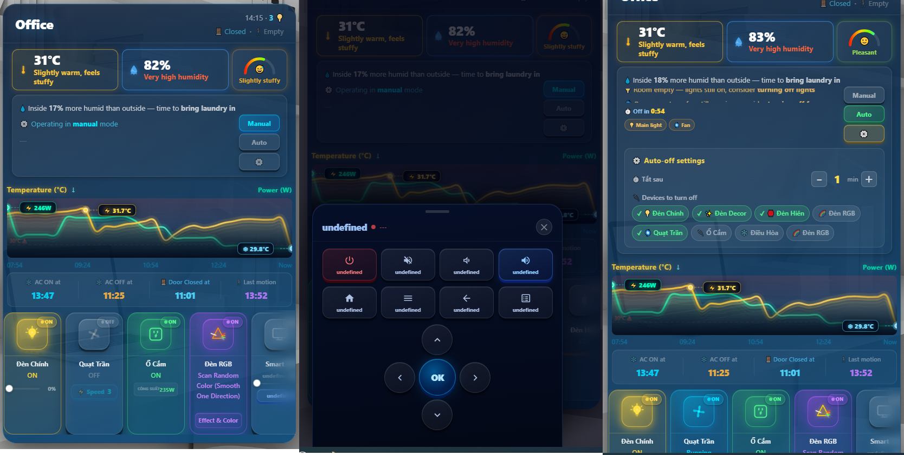
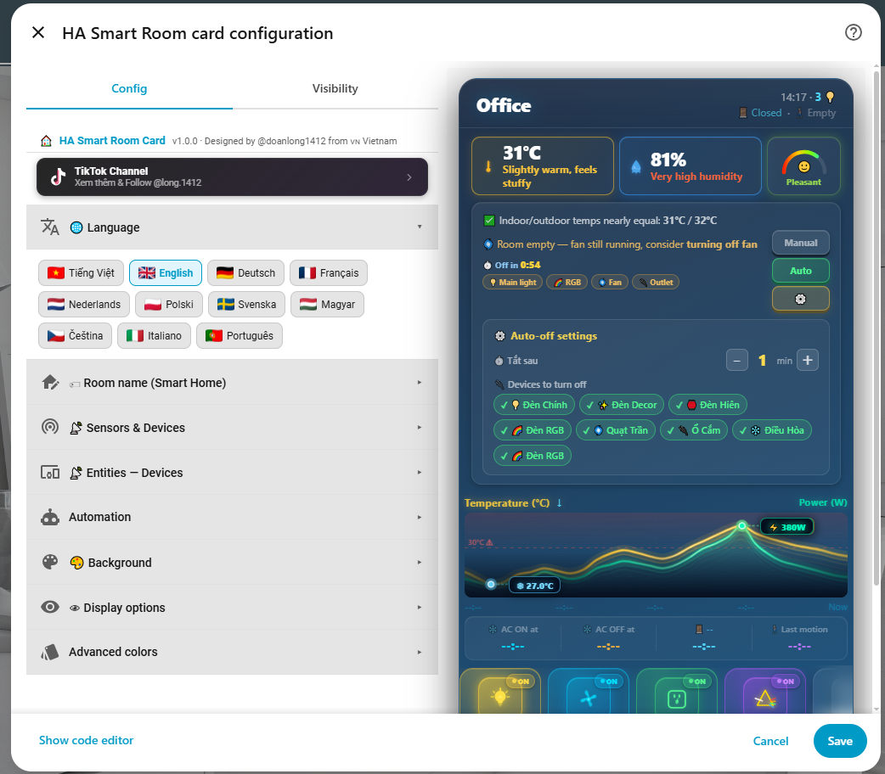

# 🏠 HA Smart Room Card

[](https://github.com/hacs/integration)


> 🇻🇳 **Phiên bản tiếng Việt:** [README_vi.md](README_vi.md)

A custom Home Assistant Lovelace card for full smart room control — live temperature & humidity sensors, multi-device control (lights, fan, outlet, AC, TV), power consumption display, motion & door sensors, auto-off mode, smart bar suggestions, environment graphs, and a full visual editor.

**No extra plugins required. Works standalone, fully configurable through the built-in UI editor.**

---

## 📸 Preview

### 🖼️ Screenshot


### 🎛️ Visual Editor


---

## ✨ Features (v1.0.0)

### 🎨 Display & Interface
- 🌡️ **Live temperature & humidity** — real-time indoor sensor display with comfort scoring
- 🌤️ **Outdoor comparison** — compares indoor vs outdoor temp/humidity and gives smart suggestions
- 📊 **Power consumption bar** — live watt display with animated fill bar for the outlet/socket
- 🚪 **Door & motion sensors** — displays door open/close state and room occupancy
- ❄️ **AC control** — full climate entity control integrated into the card
- 📈 **Environment graph** — temperature and power history chart
- 🏆 **Comfort score** — calculates and displays a room comfort score based on temp + humidity

### 🔌 Multi-Device Control
- 💡 **Main light** — brightness slider, on/off toggle
- ✨ **Decor light** — on/off toggle
- 🏮 **Porch light** — on/off toggle
- 🌈 **RGB light** — effect selector + colour picker modal
- 🌀 **Fan** — speed popup (5 levels), spin animation
- 🔌 **Outlet/Socket** — confirm-before-toggle popup, live power display with animated bar
- 📺 **Smart TV** — volume slider, remote control panel
- ➕ **Add custom devices** — add unlimited extra devices (light, RGB, fan, outlet, TV, sensor) via visual editor

### 🤖 Auto-Off Mode
- **Motion-triggered auto-off** — when the room is empty for a configurable delay, all selected devices turn off automatically
- **Countdown timer** — live countdown displayed on the card
- **Manual / Auto toggle** — switch modes directly from the card header
- **Sync via HA helpers** — optionally sync auto mode state across devices using `input_boolean` + `input_number` helpers

### 💡 Smart Bar
- Analyses room conditions (temperature, humidity, motion, door state) and gives contextual suggestions
- Examples: *"Room hotter than outside — consider turning on AC"*, *"Room empty — lights still on"*

### 🎨 Visual Customisation
- **Background presets** — Default, Night, Sunset, Forest, Aurora, Desert, Ocean, Cherry, Volcano, Galaxy, Ice, Olive, Slate, Rose, Teal, Custom
- **Custom colours** — bg gradient, accent, text
- **Custom background transparency** — slider for bg alpha

### 🌐 Multi-language Support (11 languages)
- 🇻🇳 Tiếng Việt / 🇬🇧 English / 🇩🇪 Deutsch / 🇫🇷 Français / 🇳🇱 Nederlands
- 🇵🇱 Polski / 🇸🇪 Svenska / 🇭🇺 Magyar / 🇨🇿 Čeština / 🇮🇹 Italiano / 🇵🇹 Português

### 🎛️ Visual Config Editor
- Full drag-and-drop style device management: add, remove, reorder, rename devices
- Per-device entity picker, MDI icon override
- Automation settings: delay, entity selection, helper sync
- Display toggles: show/hide score, graph, smart bar, auto mode button
- Language, background, colour pickers — all in-UI, no YAML required

---

## 📦 Installation

### Option 1 — HACS (recommended)

**Step 1:** Add Custom Repository to HACS:

[](https://my.home-assistant.io/redirect/hacs_repository/?owner=doanlong1412&repository=ha-smart-room-card&category=plugin)

> If the button doesn't work, add manually:
> **HACS → Frontend → ⋮ → Custom repositories**
> → URL: `https://github.com/doanlong1412/ha-smart-room-card` → Type: **Dashboard** → Add

**Step 2:** Search for **HA Smart Room Card** → **Install**

**Step 3:** Hard-reload your browser (`Ctrl+Shift+R`)

---

### Option 2 — Manual

1. Download [`ha-smart-room-card.js`](https://github.com/doanlong1412/ha-smart-room-card/releases/latest)
2. Copy to `/config/www/ha-smart-room-card.js`
3. Go to **Settings → Dashboards → Resources** → **Add resource**:
   ```
   URL:  /local/ha-smart-room-card.js
   Type: JavaScript module
   ```
4. Hard-reload your browser (`Ctrl+Shift+R`)

---

## ⚙️ Configuration

### Step 1 — Add the card

```yaml
type: custom:ha-smart-room-card
```

After adding, click **✏️ Edit** to open the visual Config Editor — no manual YAML needed.

### Step 2 — Full YAML example

```yaml
type: custom:ha-smart-room-card
language: en
room_title: Office
background_preset: default
bg_alpha: 91
show_score: true
show_graph: true
show_smart_bar: true
show_auto_mode: true
auto_delay_min: 5
sync_mode: local          # local | helpers

# Sensors
temp_entity: sensor.room_temperature
humi_entity: sensor.room_humidity
power_entity: sensor.room_power
door_entity: binary_sensor.room_door
motion_entity: binary_sensor.room_motion
temp_out_entity: sensor.outdoor_temperature
humi_out_entity: sensor.outdoor_humidity

# Devices
den_entity: light.main_light
decor_entity: light.decor_light
hien_entity: light.porch_light
rgb_entity: light.rgb_strip
quat_entity: fan.ceiling_fan
ocam_entity: switch.outlet
ocam_power_entity: sensor.outlet_power   # optional power sensor for outlet
tv_entity: media_player.smart_tv
tv_remote_entity: remote.tv_remote
ac_entity: climate.air_conditioner

# Auto-off
auto_off_entities:
  - den
  - decor
  - rgb
  - hien
  - quat
  - ocam
  - ac

# Optional — sync auto mode via HA helpers (sync_mode: helpers)
helper_bool: input_boolean.hsrc_auto_mode
helper_num: input_number.hsrc_no_motion_since
```

### Available config keys

| Key | Type | Default | Description |
|-----|------|---------|-------------|
| `language` | string | `vi` | Interface language (`vi`, `en`, `de`, `fr`, `nl`, `pl`, `sv`, `hu`, `cs`, `it`, `pt`) |
| `room_title` | string | `Smart Room` | Room name shown in header |
| `background_preset` | string | `default` | Background gradient preset |
| `bg_alpha` | number | `91` | Background transparency (0–100) |
| `show_score` | bool | `true` | Show comfort score |
| `show_graph` | bool | `true` | Show environment graph |
| `show_smart_bar` | bool | `true` | Show smart suggestion bar |
| `show_auto_mode` | bool | `true` | Show auto-off mode button |
| `auto_delay_min` | number | `5` | Minutes of no motion before auto-off |
| `sync_mode` | string | `local` | `local` = localStorage only, `helpers` = sync via HA helpers |
| `temp_entity` | entity | — | Indoor temperature sensor |
| `humi_entity` | entity | — | Indoor humidity sensor |
| `power_entity` | entity | — | Power sensor (shown on outlet card) |
| `door_entity` | entity | — | Door binary sensor |
| `motion_entity` | entity | — | Motion binary sensor |
| `temp_out_entity` | entity | — | Outdoor temperature sensor |
| `humi_out_entity` | entity | — | Outdoor humidity sensor |
| `den_entity` | entity | — | Main light entity |
| `decor_entity` | entity | — | Decor light entity |
| `hien_entity` | entity | — | Porch light entity |
| `rgb_entity` | entity | — | RGB light entity |
| `quat_entity` | entity | — | Fan entity (`fan.*` or `switch.*`) |
| `ocam_entity` | entity | — | Outlet switch entity |
| `ocam_power_entity` | entity | — | Outlet power sensor (optional) |
| `tv_entity` | entity | — | Smart TV media player |
| `tv_remote_entity` | entity | — | TV remote entity |
| `ac_entity` | entity | — | Air conditioner climate entity |
| `helper_bool` | entity | `input_boolean.hsrc_auto_mode` | Helper for auto mode sync |
| `helper_num` | entity | `input_number.hsrc_no_motion_since` | Helper for motion timestamp sync |

---

## 🤖 Auto-Off Helpers (optional)

To sync the auto-off mode across multiple devices/browsers, create these helpers in HA:

```yaml
# configuration.yaml  (or create via Settings → Helpers)
input_boolean:
  hsrc_auto_mode:
    name: HSRC Auto Mode

input_number:
  hsrc_no_motion_since:
    name: HSRC No Motion Since
    min: 0
    max: 9999999999999
    step: 1
    mode: box
```

Then set `sync_mode: helpers` in the card config.

---

## 🖥️ Compatibility

| | |
|---|---|
| Home Assistant | 2023.1+ |
| Lovelace | Default & custom dashboards |
| Devices | Mobile & Desktop |
| Dependencies | None — fully standalone |
| Browsers | Chrome, Firefox, Safari, Edge |

---

## 📋 Changelog

### v1.0.0
- 🚀 Initial release under new name **HA Smart Room Card**
- 🔌 Outlet power sensor support — dedicated `ocam_power_entity` field in editor and card
- 🌀 Fan domain support — picker now accepts `fan.*` entities in addition to `switch.*`
- 🛠️ Visual editor: fixed "Add device" button not showing new device immediately
- 🛠️ Fixed duplicate event listener accumulation on device list re-render
- ➕ Extra device support: add unlimited custom devices via editor (light, RGB, fan, outlet, TV, sensor)
- 🔌 Extra outlet devices show live power bar when a power sensor is configured
- 🌐 11 languages supported

---

## 📄 License

MIT License — free to use, modify, and distribute.
If you find this useful, please ⭐ **star the repo**!

---

## 🙏 Credits

Designed and developed by **[@doanlong1412](https://github.com/doanlong1412)** from 🇻🇳 Vietnam.
